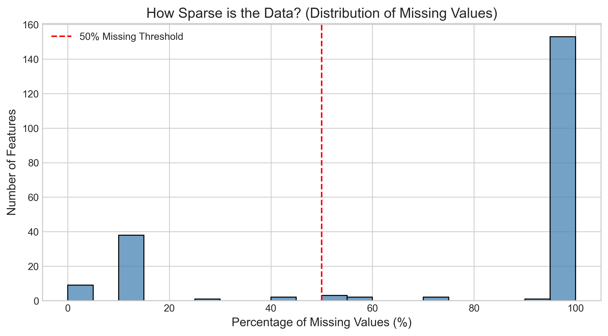
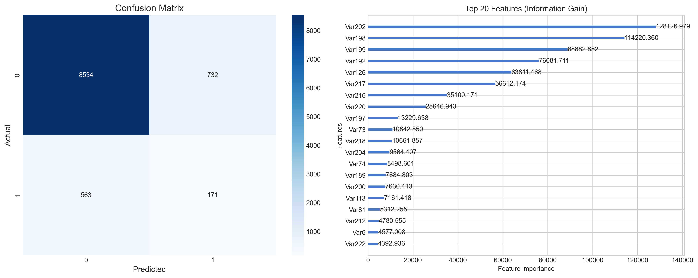

# Customer Churn Prediction: High-Sparsity Tabular Dataset

## 📌 Project Overview
This repository contains a complete machine learning pipeline designed to predict customer churn for a subscription-based business. The primary challenge of this project lies in the dataset's extreme sparsity and high class imbalance. 

The goal is to accurately identify potential churners, prioritizing Recall over Precision, as the business cost of missing a churner is significantly higher than the cost of a false alarm.

## 📂 Repository Structure
* `churn_analysis_and_model.ipynb`: The primary Jupyter Notebook containing EDA, preprocessing, feature engineering, and model training.
* `requirements.txt`: List of Python dependencies required to run the notebook.
* `missingness_plot.png`: Distribution of missing values across features.
* `model_evaluation.png`: Confusion Matrix and Top 20 Feature Importances.
* `README.md`: Project documentation and business summary.

*(Note: The raw `train.csv` and `train_labels.csv` files are excluded from version control for data privacy.)*

## 📊 Exploratory Data Analysis (EDA)
The dataset consists of 50,000 customers and 230 anonymized features. Our EDA revealed two critical hurdles:
1. **Extreme Sparsity:** Over 150 out of the 230 features are missing between 95% and 100% of their data. 
2. **Class Imbalance:** The target variable is highly imbalanced, with a churn rate of approximately 7.3%.

## 🛠️ Methodology & Feature Engineering
Given the anonymized behavioral nature of the features, standard imputation techniques (like mean or median imputation) would introduce massive amounts of noise. Instead, we treated **missingness as a direct behavioral signal**. A missing value likely indicates a lack of customer interaction with a specific platform feature.

* **Missingness Indicators:** Created explicit binary flags (`1` if missing, `0` if present) for highly sparse columns.
* **Activity Footprint:** Extracted row-wise missingness counts to capture a user's overall drop in activity.
* **Native Categorical Handling:** Formatted object columns as `category` types to allow the gradient boosting algorithm to handle them natively without exploding the feature space via One-Hot Encoding.

## 🤖 Modeling Approach
We selected **LightGBM (Light Gradient Boosting Machine)** for the final model. 
* **Why LightGBM?** It is highly optimized for sparse datasets and natively handles categorical features, drastically reducing memory usage and training time.
* **Handling Imbalance:** Rather than using synthetic resampling techniques like SMOTE (which perform poorly in highly sparse, anonymized spaces), we utilized **Cost-Sensitive Learning**. We applied the `scale_pos_weight` parameter to heavily penalize the model for missing the minority class (churners).

## 📈 Evaluation & Results
Because the business cost of missing a churner outweighs the cost of a false positive, standard metrics like Accuracy or ROC-AUC are misleading. We optimized and evaluated the model based on:
1. **Recall:** Capturing as many actual churners as possible.
2. **PR-AUC (Precision-Recall Area Under Curve):** A superior overall metric for severe class imbalances.
3. **F2 Score:** A weighted harmonic mean that prioritizes Recall twice as heavily as Precision.

### **Final Model Metrics**
* **F2 Score:** 0.2227
* **PR-AUC Score:** 0.1402
* **Recall (Minority Class):** 0.23 (Successfully captured 171 actual churners)

### **Key Drivers of Churn**
Based on Information Gain, the top predictors of churn are:
1. `Var202`
2. `Var198`
3. `Var199`
4. `Var192`
5. `Var126`

*Recommendation:* Partner with Data Engineering to de-anonymize these specific features to build targeted retention campaigns around these behaviors.

## 🚀 Future Improvements
With additional time, the following enhancements could be implemented:
* **Optuna Hyperparameter Tuning:** Automated tuning of `max_depth`, `learning_rate`, and `num_leaves`.
* **SHAP Value Analysis:** Generating local explanations to understand exactly *why* a specific user is flagged as high-risk.
* **Custom Thresholding:** Adjusting the probability threshold (e.g., from 0.5 to 0.4) to further maximize the F2 score based on explicit business cost ratios.
